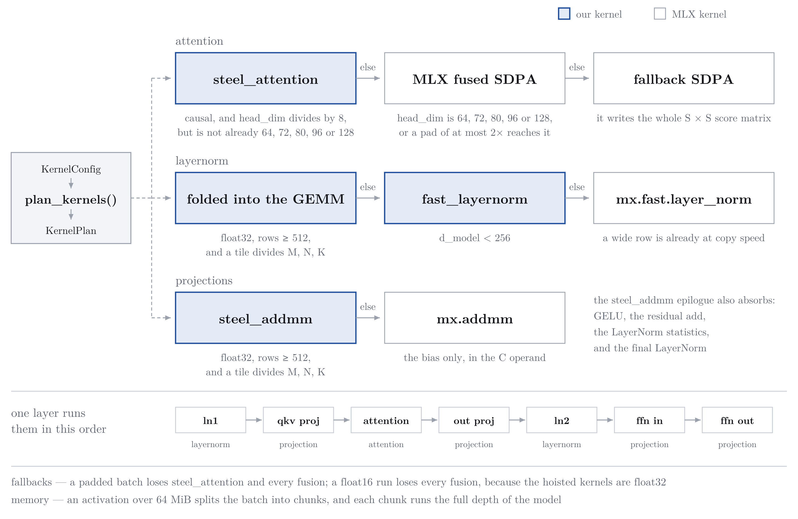

# Figures

Diagrams that explain the design. They are not measurements. Every number a
diagram shows must also appear in a reference file or in `OPTIMIZATIONS.md`,
and that text is the source of truth. If a diagram and a table disagree,
correct the diagram.

| File | Subject |
|---|---|
| `kernel-dispatch.png` | The `plan_kernels()` decision tree: which kernel each of the three stages takes, and the condition that selects it |
| `kernel-dispatch-shape6.png` | The same tree, resolved for shape 6, with the kernel that each step of one layer becomes |

## Two files for each diagram

Each diagram has a `-dark` variant. The background of both is transparent.

- `<name>.png` draws in dark ink, for a white page.
- `<name>-dark.png` draws in light ink, for a dark page.

A viewer that shows the plain file on a dark background hides most of the
text. That is the expected result, not a broken export. Pick the variant
that matches the page. In Markdown on GitHub, use both:

    <picture>
      <source media="(prefers-color-scheme: dark)" srcset="kernel-dispatch-dark.png">
      
    </picture>

## There is no source file

**These four PNGs are the only copy.** No `.tex`, `.svg` or other source is
in this repository, so no script can rebuild them. Git tracks them for that
reason. Do not delete one expecting to regenerate it.

To change a diagram you must redraw it. If you do, commit the source next to
the PNG, and delete this section.

The charts under `profiling/results/harness/` are the opposite case:
`profiling/tools/plot_runtime.py` rebuilds them from a sweep, so they are
reproducible.
